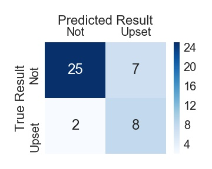
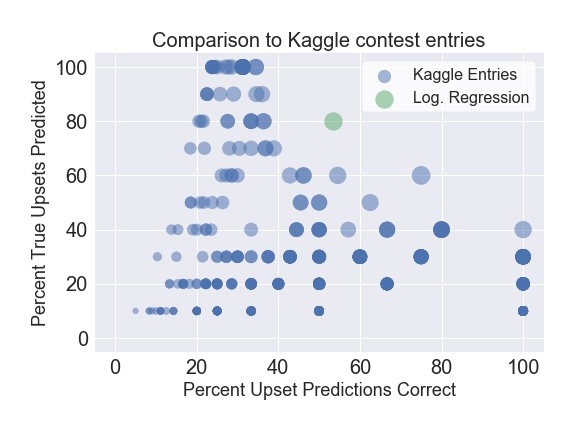
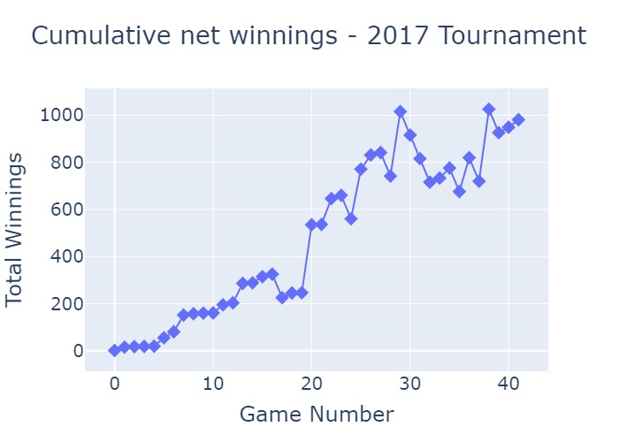

## The Upset Detector
A machine learning project for predicting upsets in the college basketball tournament 

## Project Motivation
I developed this project to create predictive models for upset detection in college 
basketball. In sports terminology, an "upset" occurs when a team believed to have
a low chance of winning ("the underdog") unexpectedly beats their opponent ("the favorite"). 
Upsets in the college basketball tournament are an interesting prediction problem, for several reasons:
- Millions of people participate in bracket pools every year, creating a massive consumer market for accurate upset prediction guidance.
- Each upset is an unexpected single event, but upsets occur often enough (~20% of the time) that 
each game has some upset risk. Consumers attempt to account for this risk by guessing which games will be upsets, 
but most of the time those guesses are wrong. 
- There is no clear consensus on factors that predict upsets, and even the best
[prediction systems](https://www.google.com/search?q=fivethirtyeight+ncaa+tournament+predictions&rlz=1C1CHBF_enUS840US840&oq=fivethirtyeight+ncaa+tournament+predictions&aqs=chrome..69i57j0l7.8663j0j7&sourceid=chrome&ie=UTF-8)
don't predict upsets well.
- Because upsets are unexpected events, bets on underdogs to win have a large return on investment. 
For example, in college basketball games with 4-12 point spreads, correct bets on underdog winners
average a 300% net return. This ROI creates an opportunity to profit by betting on underdogs, even if 
one's overall accuracy is modest. 

## Project Summary
The rest of this page provides a high-level overview of the structure of this project 
and the results (side note: I continue to update this project privately with the intent
of releasing a web tool, so this repo contains only some of the features and updates).

### Data Sources
By accessing public downloadable files and writing web scrapers I collected raw data in several domains
relevant for upset prediction.

- Game scores and statistics - Final scores and box-score statistics from past college basketball games  
- Adjusted team ratings - Composite metrics of a team's total, offensive, and defensive ability. These ratings 
adjust for situational factors (pace, schedule strength) that can obscure a team's ability based on win-loss record alone.  
- Coaches - Names of coaches with career data on teams coached each season.  
- Team rosters - Names of players with year of college, height, and position.  
- Player data - End-of-season summaries of box-scores statistics for each player on team from two sports statistics websites.    
- Geographical data - Locations of teams and games.  
- Tournament "seeds" - A ranking assigned prior to the tournament determining 
the team's perceived strength and their expected opponents.  

### Data Transformation and Feature Engineering
One major hurdle for this project was aligning and transforming the raw data into usable, team-level features 
for machine learning. Below are some examples of the data transformation problems. 

- merging features from multiple data sources with different team names
- integrating player data from two sources with variable missing data patterns and 
inconsistent names for the same player
- combining coach histories and team results to leverage coach experience and success in features
- use game-level statistics to create predictive team-level features

To keep project code organized and clear, I created importable Python modules and functions
to execute distinct steps of the pipeline. For example, the `players` module contains
all functions to transform player-level data, such as `starter_indicator`, which takes a dataframe
containing player minutes-per-game and adds a column indicating if the player is a starter or not. 

Details for each module can be found in the `src` subdirectory README files and in the module 
docstrings. The final feature set contained 164 features for each tournament matchup 
spanning the domains of coach historical performance, team statistical
production profiles, player experience, player height, and temporal metrics of team performance.

### Data Exploration
I used data exploration to gain insights into features or feature combinations
that could be useful in predicting upsets. A few examples are shown below. 

#### Underdog and Favorite Efficiency Rating
Upsets (in red) shown as function of favorite efficiency rating (vertical axis) and
underdog efficiency rating (horizontal axis). Upsets are concentrated in matchups 
that pit favorites with ratings below 25 against underdogs with ratings above 10.  

This plot suggests a reasonable baseline model could be informed by 3 features:
underdog efficiency, favorite efficiency, and their product.  

#### Offensive Rebound plus Turnover Margin  
This metric represents the extent that a team typically creates an advantage in scoring 
opportunities by getting more offensive rebounds and having fewer turnovers
than their opponent. I split the data by upset status (upset or not), and 
computed the average margin for the favorites and underdogs in each game. Upsets tend to occur
when an underdog has a greater margin than their favored opponent. 

#### Strength of schedule rating  
"Strength of schedule" captures the difficulty of a team's previous opponents over
the course of their season, as computed on [sports-reference.com](https://www.sports-reference.com/cbb/).
Upsets tend to involve underdogs who played a more difficult pre-tournament schedule. 
 

### Machine Learning
This section describes my overall machine learning strategy to develop an upset prediction model. 

#### Classification algorithms
Because the target variable has only 2 levels (upset or not), I used classification
algorithms to model upsets. Using the classifiers in `scikit-learn`, I tested several
algorithms: regularized logistic regression, neural network,
random forests, and gradient-boosted trees. I tested these four algorithms because they 
provided a reasonable diversity in algorithm complexity.

#### Choice of classification metric
To compare performance of each model, I used the *F1* score to achieve optimal balance 
between upset precision (being correct when predicting an upset) and upset recall 
(detecting as many true upsets as possible). This metric aligns with the business
goal of predicting upsets while maintaining good accuracy on those predictions. 

#### Model selection with *k*-fold cross-validation and held-out test set
The original dataset contained 584 examples of college tournament games between teams 
seeded at least 4 slots apart. Prior to machine learning, I removed a random sample of 
20% of those games to reserve as a held-out test set. The remaining 80% of games were
used for 5-fold cross-validation. For each fold, a model was trained on the other 4 folds and 
used to predict the fold's targets. The *F1* scores were then averaged across
all five folds. This processes was repeated for each unique algorithm configuration tested 
during the hyperparameter search (see more details below), with scores logged for comparison. 

#### Resampling for imbalanced classification
Upsets in basketball are an imbalanced target, because only roughly 20% of games are upsets. 
Most classification algorithms perform best when trained on balanced data. I used the 
[*imbalanced-learn*](https://github.com/scikit-learn-contrib/imbalanced-learn) package
to create synthetic, balanced training data. Per expert [recommendations](https://www.svds.com/learning-imbalanced-classes/),
models were trained on balanced data and then used to classify the natural, imbalanced data 
during both cross-validation and test set evaluation. 

#### Automated hyperparameter search with *hyperopt* library
While working on this project I discovered the [*hyperopt*](http://hyperopt.github.io/hyperopt/) package.
Hyperopt contains tools to adaptively search for optimal hyperparameter settings
within a predefined search space to optimize an objective function. In my case, 
the objective was to maximize the cross-validation *F1* score, and I created separate
search spaces to account for the unique hyperparameters for each algorithm. 

To combine cross-validation, resampling imbalanced data, and automated hyperparameter search, 
I built custom modules and functions further described in the `src.models` directory of this project.  

### Model Selection and Results
For each algorithm, the configuration that produced the top cross-validation *F1* score
was selected and used to predict the held-out test set. Additional metrics and plots
were produced to more fully characterize algorithm performance on the test set. 

As shown in the table below, logistic regression and support vector machines 
produced the highest test set *F1* score.  

**Test set upset classification metrics for each algorithm**  
| Algorithm  | *F1* score | Recall | Precision |
| ---------- | ------------------- | --------- | ------ |
| Support Vector Machines  | 0.545  | 0.84| 0.404 |
| Logistic Regression  | 0.523  | 0.68| 0.425 |
| Gradient Boosted Trees  | 0.491  | 0.56 | 0.438 |
| Neural network  | 0.464  | 0.64 | 0.364 |
| Random Forest  | 0.424  | 0.56 | 0.341 |

I also produced ROC curves for each algorithm. I noticed that the top 3 algorithms 
each had distinct areas of superior performance on ROC curves, suggesting that 
combining these 3 models into an ensemble might produce even better predictions.  

### Business Use Case

#### Upset model performance in single tournament
To assess model performance in a typical use case, I used the logistic regression
classifier to predict upsets for a single season, the 2017 tournament.
Model predictions produced the results shown in the confusion matrix and metrics below.  

**Confusion matrix and classification metrics - 2017 tournament**  

| *F1* score | Recall | Precision | Accuracy |
| ---------- | ------ | --------- | -------- |
| 0.64 | 0.80 | 0.53 | 0.79 |

The model predicted 8 of 10 true upsets, and 8 of 15 upset predictions were correct. 
Overall accuracy was 0.79, with 33 of 42 games predicted correctly. 

#### Competitive Benchmark Comparison 
To compare this performance to predictions from other models, I obtained the publicly-released 
team prediction files from the [2017 March Machine Learning Mania Kaggle contest](https://www.kaggle.com/c/march-machine-learning-mania-2017).
Although this contest has a different scoring format (log-loss for all games), I thought these
predictions would still serve as a reasonable benchmark. For each prediction file, I converted the
game probabilities to upset predictions and computed the upset classification *F1* score. Compared to 
the full distribution of *F1* scores, my model performed in the 1st percentile, and
achieved an ideal balance between upset precision and recall as shown in the 
plot below. 

**Upset recall (vertical axis), precision (horizontal axis), and *F1* (dot size)
for my final upset detection model and all entries in 2017 Kaggle contest**   

#### Return on Investment Analysis
Using historical odds data from [this website](https://www.oddsportal.com/), I
computed the net returns for 42 hypothetical money-line bets of $100 on the winner of each game according 
to the predictions from my upset detection model. The $4200 investment produced a 
net return of $981 for a 23% ROI. The plot below shows the cumulative net
return over the course of the 2017 tournament. See [here](https://mworles.github.io/upset_detector/)
for an interactive plot with the teams, prediction, and net return for each game. 

