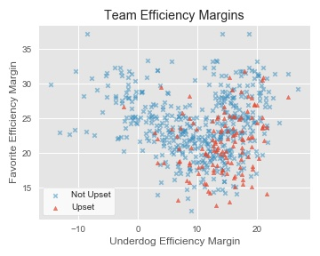
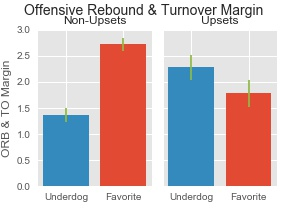
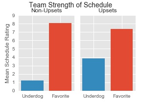
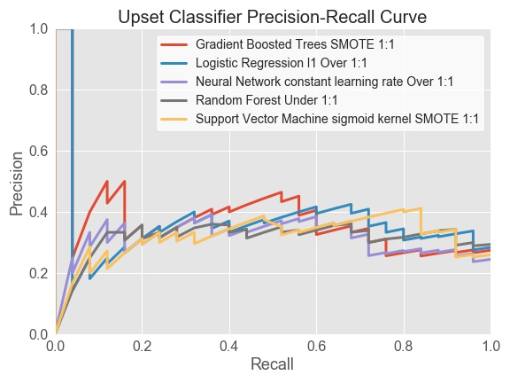
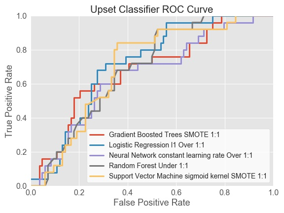

## The Upset Detector
A machine learning project for predicting upsets in the college basketball tournament 

### Project Motivation
I developed this project to create predictive models for upset detection in college 
basketball. In sports terminology, an "upset" occurs when a team believed to have
a low chance of winning ("the underdog") unexpectedly beats their opponent ("the favorite"). 
Upsets in the college basketball tournament are an interesting prediction problem, for several reasons:
- Millions of people participate in bracket pools every year, creating a massive consumer market for upset prediction guidance
- Each upset is an unexpected single event, but upsets occur often enough (~20% of the time) that 
each game has some upset risk. Consumers account for this risk by guessing which games will be upsets, 
but most of the time those guesses are wrong. 
- There is no clear consensus on factors that predict upsets, and even the best
[prediction systems](https://www.google.com/search?q=fivethirtyeight+ncaa+tournament+predictions&rlz=1C1CHBF_enUS840US840&oq=fivethirtyeight+ncaa+tournament+predictions&aqs=chrome..69i57j0l7.8663j0j7&sourceid=chrome&ie=UTF-8)
don't prioritize upset detection.  
- Because upsets are unexpected events, bets on underdogs to win typically have a
solid return on investment. For example, in games with 4-12 point spreads, correct bets on underdog winners
average 300% net return. This ROI creates an opportunity to profit on underdog wagers even if one's 
overall accuracy is not superb. 

### Project Summary
The rest of this page provides a high-level overview of the structure of this project 
and the results (side note: I continue to update this project privately with the intent
of releasing a web tool, so this repo only contains a subset of updates). 

### Data Sources
By accessing public downloadable files and writing web scrapers I collected raw data in several domains
relevant for upset prediction.

Game scores and statistics - Final scores and box-score statistics from past college basketball games  
Adjusted team ratings - Composite metrics of a team's total, offensive, and defensive ability. These ratings 
adjust for situational factors (pace, schedule strength) that can obscure a team's ability based on win-loss record alone.  
Coaches - Names of coaches with career data on teams coached each season.  
Team rosters - Names of players with year of college, height, and position.  
Player data - End-of-season summaries of box-scores statistics for each player on team from two sports statistics websites.    
Geographical data - Locations of teams and games.  
Tournament "seeds" - A ranking assigned prior to the tournament determining 
the team's perceived strength and their expected opponents.  

### Data Transformation and Feature Engineering
One major hurdle for this project was aligning and transforming the raw data into usable, team-level features 
for machine learning. Below are examples of some of the data transformation problems 
I had to solve:

- merging features from multiple data sources with different team names
- integrating player data from two sources with variable missing data patterns and 
inconsistent names for the same player
- combining coach histories and team results to leverage coach experience and success in features
- use game-level statistics to create predictive team-level features

To map out the data processing pipeline I created the diagram below:

To keep the pipeline code organized and clear, I created custom, importable Python modules and functions
to control each modular step of the processing pipeline. For example, the `players` module contains
all functions to transform player-level data, such as `starter_indicator`, a function that takes a dataframe
containing player minutes-per-game and adds a column indicating if the player is a starter or not. 

Details for each module can be found in the `src` subdirectory README files and in module 
docstrings.  

### Data Exploration
I used data exploration to generate useful insights about features or feature combinations
that could be useful in predicting upsets. Some examples are shown below. 

Upsets (in red) shown as function of favorite efficiency rating (vertical axis) and
underdog efficiency rating (horizontal axis). Upsets are concentrated in matchups 
between favorites with ratings below 25 and underdogs with ratings above 10.  

Upsets tend to involve underdogs with a greater advantage in offensive rebounds and 
turnovers in past games.  

Upsets tend to involve underdogs who played a more difficult schedule.  

### Machine Learning
This section summarizes my overall strategy to produce an upset prediction model
from machine learning. Given the complex task of combining cross-validation, resampling imbalanced data, 
and an automated hyperparameter search, I built custom modules and functions further described in 
the `src.models` directory of this project. 

##### Classification algorithms
Because the target variable has only 2 levels (upset or not), I used classification
algorithms to model upsets. The algorithms I evaluated were `scikit-learn`
implementations of regularized logistic regression, neural networks,
support vector machines, random forests, and gradient-boosted trees. These algorithms were
selected because they provided reasonable range in algorithm complexity and diversity in 
the typical optimal use cases.  

##### Classification performance metric
To compare each model on upset detection performance, I used the upset *F1* score
as the main classification metric. I selected *F1* to achieve optimal balance
between upset precision (being correct when predicting an upset) and upset recall 
(detecting as many true upsets as possible). This metric aligns with the business
goal of predicting the true upsets while maintaining good accuracy on those predictions. 

##### Model selection with *k*-fold cross-validation and held-out test set
The original dataset contained 584 examples of college tournament games between teams 
seeded at least 4 slots apart. Prior to machine learning, I removed a random sample of 
20% of those games to reserve as a held-out test set. The remaining 80% of games were
used for 5-fold cross-validation. For each fold, a model trained on the other 4 folds were 
used to predict the fold's targets and obtain the *F1* score, with *F1* scores then averaged across
all five folds. This process was repeated and logged for each unique algorithm configuration during the
hyperparameter search (see more details below). For each type of algorithm, the configuration with the top
cross-validation *F1* score was selected and used to predict the held-out test set. 

##### Resampling for imbalanced classification
Upsets in basketball are an imbalanced target, because only roughly 20% of games are upsets. 
Most classification algorithms perform best when trained on balanced data. I used the 
[*imbalanced-learn*](https://github.com/scikit-learn-contrib/imbalanced-learn) package
to create synthetic, balanced training data for each cross-validation fold during 
model training. Per expert [recommendations](https://www.svds.com/learning-imbalanced-classes/),
models were trained on synthetically-balanced data and used to classify the natural, imbalanced data. 

##### Automated hyperparameter search with *hyperopt* library
While iterating on this project I discovered the [*hyperopt*](http://hyperopt.github.io/hyperopt/) package.
Hyperopt contains tools to adaptively search for optimal hyperparameter settings
within a predefined search space to optimize an objective function (such as *F1* score). 
Because the search space will vary according to the algorithm's available hyperparameters, I again wrote
custom functions to create and store search objects, extract appropriate objects for each algorithm, and allow
iterative updates to refine the search space over time. 

### Model Selection and Results

  
**Test set scores of each classification algorithm evaluated for upset prediction**
| Algorithm  | *F1* score | Precision | Recall |
| ---------- | ------------------- | --------- | ------ |
| Support Vector Machines  | 0.545 | 0.84 | 0.40 |
| Logistic Regression  | 0.523  | 0.68| 0.425 |
| Gradient Boosted Trees  | 0.491  | 0.56 | 0.438 |
| Neural network  | 0.464  | 0.64 | 0.364 |
| Random Forest  | 0.424  | 0.56 | 0.341 |
